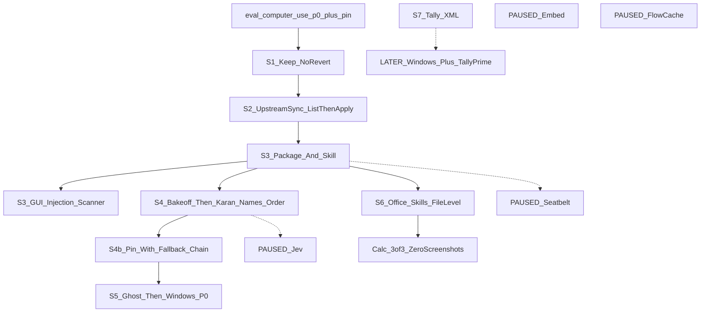

PAUSED (2026-09-24) — parked on branch computer-use-upstream-sync; resume later.

# Computer use v3

Plan only. `isProject: false`. No product code in this pass.

**SUPERSEDE v2.** On approval, add this exact first line (after frontmatter) to both [`.cursor/plans/computer-use-v2_5ed2edde.plan.md`](.cursor/plans/computer-use-v2_5ed2edde.plan.md) and [`.cursor/plans/computer-use-v2_6e6324a1.plan.md`](.cursor/plans/computer-use-v2_6e6324a1.plan.md):

`SUPERSEDED by computer-use-v3 (2026-09-24). History only; do not execute.`

Do not otherwise edit v2. Do not execute v2 phases.

---

## Grounding (carry from v2 + current-state)

Recorded 2026-09-23/24:

- **okvevo/staging** (v2 G1): `1d8a9513ff4266934d420733f97db90d4f60bb4a`
- **Working checkout** (`eval/computer-use-p0`): `e1d855e2752e7c61303005025bc7370fa0c43856` — staging plus two commits: `d85eede0c9` (P0 eval + Mac report) and `e1d855e275` (cua-driver pin). Do not revert these.
- **OkVevo-Web** `cleanup/strip-to-portal`: `73a51fa9d8f86c438ddccf771745791e4af6c987`
- **origin/main** (Nous, fetch-only) merge-base with HEAD: `4f22543509`. Branch `computer-use-upstream-sync` does **not** exist yet.
- Packaged Nia that ran P0 was bound to staging SHA `1d8a9513ff42` with **cua-driver 0.28.2** matching npm `@trycua/cua-driver` ([eval/computer_use_p0/reports/p0_mac_2026-09-23_summary.md](hermes-agent/eval/computer_use_p0/reports/p0_mac_2026-09-23_summary.md) L15–17).

Still-valid file:line (**C1 refreshed 2026-09-24** on the post-S2 split tree, branch `computer-use-upstream-sync`):

- Schema: `get_computer_use_schema()` [schema.py](hermes-agent/tools/computer_use/schema.py) L206 (description/enum live in that module; action set has `focus_app`, **no** `open_app`).
- Handler: `handle_computer_use()` [tool.py](hermes-agent/tools/computer_use/tool.py) L325 → `_request_approval()` L387 → `_dispatch()` L500. `_NoopBackend` L310–322: capture/click/drag/scroll/type_text/key/list_apps/list_windows/**focus_app**/set_value. **No `launch_app`.** Destructive is `_ACTIONS[action].destructive` (L345 / table L467–490) — still no `_DESTRUCTIVE_ACTIONS` constant. `check_computer_use_requirements()` L889 is **binary-only** (`cua_driver_binary_available` [cua_backend_driver.py](hermes-agent/tools/computer_use/cua_backend_driver.py) L100). **S3 keeps `check_fn` that way**; readiness is a handler refuse — `handle_computer_use` has **no real path** to `computer_use_status()`.
- ABC [ComputerUseBackend](hermes-agent/tools/computer_use/backend.py) L115: start/stop/is_available/capture/click/drag/scroll/type_text/key/list_apps/list_windows/focus_app/set_value/wait. **`launch_app` is CuaDriverBackend-only** ([cua_backend.py](hermes-agent/tools/computer_use/cua_backend.py) L369), not on the ABC. `type_text` [cua_backend_input.py](hermes-agent/tools/computer_use/cua_backend_input.py) L148. Capture: `.capture()` [cua_backend_capture.py](hermes-agent/tools/computer_use/cua_backend_capture.py) L291 (**no `query` field**).
- Mac/Windows ready: `computer_use_status()` [permissions.py](hermes-agent/tools/computer_use/permissions.py) L85; grant: `request_permissions_grant()` L109; doctor: `run_doctor()` [doctor.py](hermes-agent/tools/computer_use/doctor.py) L427.
- Nia vision: [vision_routing.py](hermes-agent/tools/computer_use/vision_routing.py) `_explicit_aux_vision_override()` L26 (delegates to `agent.image_routing`) + `_lookup_user_declared_supports_vision()` L36 → `image_routing._supports_vision_override`. Pin: `PINNED_CUA_DRIVER_VERSION` [tools_config_cua.py](hermes-agent/hermes_cli/tools_config_cua.py) L194 next to `_parse_cua_driver_semver()` L197; re-exported from the slim [tools_config.py](hermes-agent/hermes_cli/tools_config.py) shell.
- cua-driver stdio spawn: `_resolve_mcp_invocation()` [cua_backend_driver.py](hermes-agent/tools/computer_use/cua_backend_driver.py) L126 → `_mcp_args_with_overlay_flag()` L111. **No `_CUA_DRIVER_ARGS` node.**
- Auto remaps per HTTP call: [okvevo_auto_router.py](hermes-agent/agent/okvevo_auto_router.py) `wire_model` L28. Durable pin: `_apply_model_switch()` [server.py](hermes-agent/tui_gateway/server.py) L6191 **EXTRACTED-calls** `_session_info()` L7349 (that is the `/model` pill path). Inside it: `session["model_override"]` L6392 and the `session.info` emit. Agent primitive: `switch_model()` [agent_runtime_helpers.py](hermes-agent/agent/agent_runtime_helpers.py) L2915.
- Composer pill does **not** read `model_override` directly. `session.info` handler in [session-info.ts](hermes-agent/apps/desktop/src/app/session/hooks/use-message-stream/gateway-event/session-info.ts) L189–194 **must not** call `setCurrentModel` (sticky composer); the live label comes from session-state cache via `payload.model`. S4b must go through `_apply_model_switch` / `_session_info`, not `switch_model` alone.
- Error class SoT: [error_classifier.py](hermes-agent/agent/error_classifier.py) `FailoverReason` L34 + `classify_api_error()` L956. `ClassifiedError.should_fallback` is **True** on 401/402/403 billing — S4b must **not** follow that flag.
- Existing provider fallback: `try_activate_fallback()` [chat_completion_helpers.py](hermes-agent/agent/chat_completion_helpers.py) L2459. Graph: **no real path** from `handle_computer_use()` to `switch_model()` or `try_activate_fallback()`. Wrong semantics for S4b — **do not call it**.
- Config hook for S4b: existing `"computer_use"` dict in [config_defaults.py](hermes-agent/hermes_cli/config_defaults.py) L2505+ (`cua_telemetry`, `capture_after_mode`, …). **No `models` key today**. Do **not** put the list on the tools_config backend-type catalog.
- First-`computer_use` pin: **no hook exists.** `handle_computer_use()` L325 uses `_backend_for_call()` L231 (which calls `_get_backend()` L209 → `CuaDriverBackend` [cua_backend.py](hermes-agent/tools/computer_use/cua_backend.py) L267). Pre-tool hook definition: `_dispatch_pre_tool_call_hooks()` [plugins.py](hermes-agent/hermes_cli/plugins.py) L6831; callers `handle_function_call()` [model_tools.py](hermes-agent/model_tools.py) L872 (EXTRACTED) and `invoke_tool()` [agent_runtime_helpers.py](hermes-agent/agent/agent_runtime_helpers.py) L3445. Use a per-task flag so only the first CU call pins.
- Scanner siblings that exist: `detect_hardline_command()` [approval_detection.py](hermes-agent/tools/approval_detection.py) L180, `detect_dangerous_command()` L1516; `check_all_command_guards()` [approval.py](hermes-agent/tools/approval.py) L1166 **EXTRACTED-calls** both. **Zero** nodes named `detect_gui_injection` or `GhostBackend`. `open_app` appears only in plan files, not product. `OKVEVO_AUTO_ROWS` is a real node at [model-catalog-menu.tsx](hermes-agent/apps/desktop/src/app/shell/model-catalog-menu.tsx) L113.
- Skill not auto-loaded on Nia desktop; SKILL heading **When NOT to use `computer_use`** L290 still points shell at `terminal` ([SKILL.md](hermes-agent/skills/autonomous-ai-agents/computer-use/SKILL.md)). Capture modes L74; Actions L82; verify ladder L108.
- Computer-use SKILL `related_skills: []` (L12) — no Office routing today.

### Graphify (2026-09-24) — whole plan

Workspace graph: `graphify-out/graph.json` (206850 nodes, 376782 edges, hermes-agent + OkVevo-Web). Use `path` / `explain` on **exact labels**. Generic BFS on `launch` / `injection` / `pricing` / `ghost` is noise.

**C1 DONE 2026-09-24** (rg on the synced tree). Split files now exist. S3/S4b/S5 cites below are post-split.

- **S1 P0:** harness tests — H1 `test_routed_model_is_response_not_alias` L107; H2 `test_ledger_window_and_balance` L172; H3+H4 `test_screenshot_and_budget` L136; H5 `test_d7_scores_first_action_not_skill_lookup` L92; H6 `test_bakeoff_requires_pinned_models` L231. Client: `observed_models` L48, `screenshot_count` L81, `credits_from_usage` L115, `budget_exceeded` L140, `first_named_tool` L38, `first_action_tool` L254. Do not cite client.py L13–14 as H5 (`test_refuse_without_contact`).
- **S2:** `vision_routing.py` L26/L36 → `image_routing`. Split files on this tree: `cua_backend_{capture,daemon,driver,input,parse,session}.py`. CLI: `hermes_cli/subcommands/computer_use.py` + `computer_use_screen.py`. Pin in `tools_config_cua.py` L194.
- **S3 dispatch:** `_dispatch()` L500 does not call `launch_app`. ABC has no `launch_app`. Handler has no path to `computer_use_status()`. Default capture is `som` (`_capture_after_mode` L829). `open_app` must be schema + ABC + `_ACTIONS`/`_dispatch` + `_NoopBackend`. Fail-closed ready-check is new. Doctor/grant: `request_permissions_grant` L109, `run_doctor` L427.
- **S3 scanner:** `detect_hardline_command` [approval_detection.py](hermes-agent/tools/approval_detection.py) L180, `detect_dangerous_command` L1516, `check_all_command_guards` [approval.py](hermes-agent/tools/approval.py) L1166. `execute_code()` L1519 → `check_execute_code_guard` L1246. MCP live path: `_make_tool_handler` [mcp_tool_handlers.py](hermes-agent/tools/mcp_tool_handlers.py) L555 (imported by `mcp_tool_registration.py`); leftover monolith copy still at [mcp_tool.py](hermes-agent/tools/mcp_tool.py) L6070 / `_trust_gate_check` L4662 — **S3 must patch the handlers module**. Zero `detect_gui_injection`. C3: MCP scans executable args only; approval not hard-block.
- **S4:** `bakeoff_model_list` L25, `bakeoff_tasks` L102, `session_create_params` L101, `wire_model` L28, `OKVEVO_AUTO_ROWS` L113, `lookupModelRates` L155, `creditsFromTokens` L64 → `creditsFromUsd` L78, `settleBillModel` L53. Estimate via `creditsFromTokens` (MARGIN is not a node).
- **S4b:** `_apply_model_switch` L6191 → `_session_info` L7349. No path `handle_computer_use` → `switch_model`.
- **S5:** zero `GhostBackend` / `ghost_batch_actions` / `ghost_fill_form`. `run_p0.ps1` L1 and dump.py `_ghost_see` L257 exist. Spawn SoT: `_resolve_mcp_invocation` [cua_backend_driver.py](hermes-agent/tools/computer_use/cua_backend_driver.py) L126. No `_CUA_DRIVER_ARGS`.
- **S6:** `docx_edit.main` L165, `xlsx_edit.main` L105, `xlsx_recalc.main` L53, `xlsx_read.main` L106, `pptx_edit.main` L359. SKILL Procedure headings docx L87, xlsx L93, pptx L91. Old ~L242/~L251/~L428 cites are stale.
- **S7:** dump.py names TallyPrime for AX/UIA only. Zero `localhost:9000` / Tally XML skill. `TurnTally` is unrelated.
- **Paused:** zero product nodes for Seatbelt, Jev, `POST /api/gateway/decisions`, flow cache.

No product nodes: `detect_gui_injection`, `GhostBackend`, `computer_use.models`, `open_app` (plans only), `PINNED_CUA_DRIVER_VERSION` (constant in tools_config_cua.py L194), `_CUA_DRIVER_ARGS`, `_DESTRUCTIVE_ACTIONS` (gate is `_ACTIONS[].destructive` + `_request_approval` L387).

---

## P0 Mac results (do not re-litigate)

Source: [p0_mac_2026-09-23.csv](hermes-agent/eval/computer_use_p0/reports/p0_mac_2026-09-23.csv) / summary L125–131. Default model `okvevo/auto-cost`. **No 150k token cap on that run.**

- **Notes:** `base_notes` 3/3 True (CSV L116–118); vague Notes 6/6 True (L134–139) → Notes-family **9/9**. The v3 brief’s “Notes 5/5” is not a CSV row; CSV is the source of truth.
- **WhatsApp regression:** 2/3 (`marker_in_cua`; third timed out).
- **Vague WhatsApp:** 0/3.
- **Calc (GUI):** 0/3 (`a4_not_in_ax`); peak **3,212,081** tokens on `base_calc` rep 3 (CSV L124).
- Overall baseline 11/21; mean tokens ~724k. Tally skipped (`windows_only`).
- D7 was recorded on Auto (summary L52+). **v3 does not use D7 10/10 as a gate.** H5 already treats `skill_view` / `skills_list` as neutral.

H1–H6 already on `eval/computer-use-p0` (commit `d85eede0c9`). Client helpers + harness tests (graph):

- **H1** routed model: `observed_models()` / `.routed_model()` [client.py](hermes-agent/eval/computer_use_p0/client.py) L48, L263; test `test_routed_model_is_response_not_alias` L107
- **H2** credits: `credits_from_usage()` L115 + [ledger.py](hermes-agent/eval/computer_use_p0/ledger.py); test `test_ledger_window_and_balance` L172
- **H3** turn/token cap → `budget_exceeded()` L140; [config.example.json](hermes-agent/eval/computer_use_p0/config.example.json) L15–16 (`max_llm_turns` 12, `max_tokens` 150000); test `test_screenshot_and_budget` L136
- **H4** screenshot count: `screenshot_count()` L81 (same test as H3)
- **H5** first **action** tool: `first_named_tool()` L38, `.first_action_tool()` L254; test `test_d7_scores_first_action_not_skill_lookup` L92 (D7 is a **scoring** test, not a 10/10 routing gate)
- **H6** 2–3 pinned models, not Auto: `bakeoff_model_list()` [tasks.py](hermes-agent/eval/computer_use_p0/tasks.py) L25; test `test_bakeoff_requires_pinned_models` L231; config L17–21 already lists haiku / gpt-mini / gemini-flash

S4 will **extend** H6 only as a 2–3 pinned-slug list in `bakeoff_models` (no Auto). Do not revert H1–H6. Today’s 2–3 cap and Auto drop in [tasks.py](hermes-agent/eval/computer_use_p0/tasks.py) L25–41 already match Stage A; do not add bake-off slugs to [okvevo_auto_allowlists.py](hermes-agent/agent/okvevo_auto_allowlists.py).

---

## Architecture (v3 only)

One model-facing desktop tool stays `computer_use`. Office files go through bundled file-level skills. Tally XML is later. Jev is not a tool.

---

## S1 — Keep P0 changes

No product work. Do not revert `eval/computer_use_p0/` or `PINNED_CUA_DRIVER_VERSION = "0.28.2"`. Continue from branch `eval/computer-use-p0` (or merge it forward; never drop the pin).

**Exit:** pin still `0.28.2`; `scripts/run_tests.sh tests/hermes_cli/test_install_cua_driver.py` and `python eval/computer_use_p0/test_p0_harness.py` still pass (H1–H6 tests named above).

---

## S2 — Upstream sync of `computer_use`

Create branch `computer-use-upstream-sync` from the P0 branch. **List** the `origin/main` delta for `tools/computer_use/`. On **this** checkout the graph has **one** [cua_backend.py](hermes-agent/tools/computer_use/cua_backend.py) (4137 lines) and **zero** nodes for `cua_backend_{capture,daemon,driver,input,parse,session}.py` or `hermes_cli/subcommands/computer_use.py` — that split exists upstream only. Stop. Apply **only after Karan approves that list**.

Must preserve:

1. `vision_routing.py` `_explicit_aux_vision_override()` L56 and `_lookup_user_declared_supports_vision()` L67 → `agent.image_routing`
2. `PINNED_CUA_DRIVER_VERSION = "0.28.2"` (next to `_parse_cua_driver_semver` L974)

Push target is `okvevo` only. Never `origin`.

**Exit:**

- Approved list applied; Nia vision routing still delegates; pin still 0.28.2; `scripts/run_tests.sh tests/tools/test_computer_use*.py tests/computer_use/` green.
- **Packaged-app regression** after the apply (bind checkout / packaged Nia, not `npm run dev`): P0 Notes + WhatsApp subset, **3 reps**, budget caps on (`max_llm_turns` 12, `max_tokens` 150000). Tasks that produced the Mac baseline: `base_notes` + `base_vague_notes` + `base_vague_notes2` + `base_whatsapp_regression`. **Pass = no worse than P0 Mac:** Notes-family **9/9**, WhatsApp **2/3**.

**C1 — DONE 2026-09-24.** Post-split cites: tool.py `_dispatch` L500, `_capture_after_mode` L829, `_capture_response` L676 / cap `_DEFAULT_MAX_ELEMENTS` L558, cua_backend_capture `.capture` L291 / cua_backend `.launch_app` L369, `_resolve_mcp_invocation` cua_backend_driver.py L126, `_make_tool_handler` mcp_tool_handlers.py L555, `_apply_model_switch` L6191. **No S3 coding on the old monolith line numbers.**

**S2 accepted 2026-09-25 (non-inferior).** Fair A/B on `qwen/qwen3.8-27b`, cua 0.28.2, 12/150k, interleaved 3×4: A=`e1d855e275` 6/12 vs B=`3b5b1bd005` 5/12 (within noise at n=12); credits/success 282 vs 309 (B cheaper). WhatsApp first-tool mix still worse on B (1/3 `computer_use` vs 3/3) — that is an S3 schema/routing job, not an S2 reject. CSV: [r2_ab_mac_2026-09-24.csv](hermes-agent/eval/computer_use_p0/reports/r2_ab_mac_2026-09-24.csv). Cap/rsync harness: `27513ba404` on `okvevo` `computer-use-upstream-sync`.

---

## S3 — Small fixes (package + skill) and scanner (outside)

Do this **after** S2 **and C1** (cites refreshed on the split tree). No S3 coding on monolith line numbers.

### Inside [`tools/computer_use/`](hermes-agent/tools/computer_use/) + [`skills/autonomous-ai-agents/computer-use/SKILL.md`](hermes-agent/skills/autonomous-ai-agents/computer-use/SKILL.md)

- **`open_app`:** add to schema enum **and** `_ACTIONS` / `_dispatch()` L500 **and** `ComputerUseBackend` ABC (backend.py L115) **and** `_NoopBackend` (tool.py L310 next to `focus_app`). Map to existing `CuaDriverBackend.launch_app()` [cua_backend.py](hermes-agent/tools/computer_use/cua_backend.py) L369. Mark it `destructive=True` like `focus_app` (L482) so `_request_approval()` L387 runs. Keep `focus_app` as window-select (ABC L167, cua_backend_capture.py L371).
- **Fail closed (handler only):** keep `check_computer_use_requirements()` **binary-only** (L889 → `cua_driver_binary_available` cua_backend_driver.py L100) so the registry still **offers** `computer_use`. Do **not** gate `check_fn` on TCC/`ready`. Today `handle_computer_use()` has **no** path to `computer_use_status()` — add the refuse in the handler when `computer_use_status()["ready"]` is not true (Mac: both TCC; Windows: doctor/health until S5 Ghost `is_available`). Return **actionable JSON** naming `request_permissions_grant()` ([permissions.py](hermes-agent/tools/computer_use/permissions.py) L109) and `run_doctor()` ([doctor.py](hermes-agent/tools/computer_use/doctor.py) L427) / Settings card. Never hide the tool. No `terminal` GUI fallback.
- **Newlines / send:** `\n` in `type` → Shift+Return (not Return). Send/save/post/pay is its own confirmed step (click Send; never Return-as-send).
- **Retries:** max 2 failed verifies, then ask. Encode in schema + a tool-side cap so the model cannot loop.
- **AX-first capture:** default to the accessibility tree; screenshot overlay **only when the tree is empty or 0×0**. Today `_capture_after_mode()` L829 + `test_capture_after_mode_default_som` default **`som`** (the opposite). `_maybe_follow_capture()` L720 is the follow-up hook.
- **Accuracy (`query` before the 100 cap):** when the model names a target (label/role), pass it through to cua-driver `get_window_state` as `query` **before** the Hermes slice in `_capture_response()` L676 (cap `_DEFAULT_MAX_ELEMENTS` L558). Today `.capture()` on the capture mixin (cua_backend_capture.py L291) does not take a query field. **Before coding:** confirm the parameter name on **cua-driver 0.28.2** via `tools/list`. Then plumb schema → backend. Do not drop query matches in favor of the first 100 nodes.
- **Routing sentence** — put this exact text in the schema description (skill may repeat; schema is the contract):

> Office files (xlsx/docx/pptx/csv) → the bundled Office skills (edit the file directly). Any app with a skill → follow the skill. Otherwise → computer_use. Never click/type from terminal. Ask the user only about task ambiguity or before send/save/post/pay.

Do **not** mention Tally here until S7 ships.

### Outside the package (listed separately)

**GUI-injection scanner** in [approval_detection.py](hermes-agent/tools/approval_detection.py) (siblings moved here): `detect_gui_injection(text)` — **no graph node today**. Sibling of `detect_hardline_command()` L180 and `detect_dangerous_command()` L1516. Patterns: System Events `keystroke`/`click`/`key code`, `cliclick`, `xdotool`, `pyautogui`, `pynput`, `CGEventPost`, ctypes `SendInput`, PowerShell/wscript/cscript `SendKeys`, AutoHotkey, `nircmd`.

**C3 — two severities:**

- **Hard-block** (unchanged): `check_all_command_guards()` [approval.py](hermes-agent/tools/approval.py) L1166 (terminal; after hardline) and `check_execute_code_guard()` L1246 (`execute_code()` L1519 INFERRED-calls this).
- **Require approval, not hard-block:** `_make_tool_handler()` [mcp_tool_handlers.py](hermes-agent/tools/mcp_tool_handlers.py) L555 (live path via `mcp_tool_registration.py`; `_trust_gate_check` L59). Scan **only executable arguments**: fields named `command` / `cmd` / `code` / `script` / `shell`, or schema type marked as code. Do **not** scan note/text/description/prompt args. Do **not** patch the leftover monolith copy in mcp_tool.py L6070.

Unit tests: per pattern + a safe `echo`; **MCP note/text argument containing `pyautogui` is NOT blocked** (and does not require approval). An MCP `command`/`code` arg with `pyautogui` requires approval. Defense-in-depth; not an OS boundary.

**Exit:** `open_app` in schema; tool still **offered** when the binary exists and OS is supported (not-ready does not drop it from the tool list); not-ready **handler** returns actionable JSON (missing grant, how to grant, doctor) and does not click; `type` with `\n` does not send in WhatsApp; 3rd failed verify asks; capture without screenshot when AX is populated; **target present when the window has >100 elements** (named label/role survives the 100 cap); schema contains the routing sentence **without** Tally; scanner tests green including the MCP note/`pyautogui` non-block.

**Implemented 2026-09-25** (schema edited once; keep frozen). Unit tests: `tests/tools/test_computer_use_s3.py` + `tests/tools/test_gui_injection_scanner.py` + existing `test_computer_use.py` (108 passed). **S3 exit A/B:** same harness as R2 — A=`e1d855e275` vs S3 working tree, `qwen/qwen3.8-27b`, 12/150k, interleaved 3×4. Pass = S3 success > A AND WhatsApp first_tool `computer_use` 3/3.

**S3 exit FAIL 2026-09-25.** CSV: [s3_ab_mac_2026-09-24.csv](hermes-agent/eval/computer_use_p0/reports/s3_ab_mac_2026-09-24.csv). A 4/12 vs S3 3/12 (not greater). WhatsApp first_tool `computer_use`: A 2/3, S3 **0/3**. Credits/success A 438 vs S3 539. Most Notes still first-tool `terminal`. WhatsApp S3: empty first_tool + `budget_exceeded` 3/3 (0 screenshots). Do not start S4 bake-off runs.

---

## S4 — Model bake-off, then pin

After S3. **Tasks:** `bake_notes` + `bake_whatsapp` only ([tasks.py](hermes-agent/eval/computer_use_p0/tasks.py) L102–124). Calc is file-level in S6 — not an S4 arm. Budget caps on (`max_llm_turns` 12, `max_tokens` 150000).

### B1 — Existing passthrough (no OkVevo-Web / Auto code)

The portal **already** passes any OpenRouter-priced explicit `model` through [route.ts](OkVevo-Web/src/app/api/gateway/chat/completions/route.ts): `modelFromBody` is defined ~L39 and used at L121. Pricing: `lookupModelRates` is [pricing.ts](OkVevo-Web/src/lib/gateway/pricing.ts) L155–176. L208–218 is `resolveChatReserveRates`, which **calls** `lookupModelRates` for non-alias slugs (L217). Confirm rates via `lookupModelRates`, not by citing L208–218 as that function. The desktop picker is **Auto-only** ([model-catalog-menu.tsx](hermes-agent/apps/desktop/src/app/shell/model-catalog-menu.tsx) `OKVEVO_AUTO_ROWS` L113–116). The harness already sends that explicit path: [run_p0.py](hermes-agent/eval/computer_use_p0/run_p0.py) `session_create_params` (`model` + `provider: openrouter`, L101–107).

Therefore:

- **No OkVevo-Web code** for S4: no `eval-explicit-models.ts`, no env flags, no `route.ts` gate, no `pricing.ts` map.
- **No edits** to Auto allowlists/router ([okvevo_auto_allowlists.py](hermes-agent/agent/okvevo_auto_allowlists.py), [okvevo_auto_router.py](hermes-agent/agent/okvevo_auto_router.py)), the composer catalog, or [hermes_cli/models.py](hermes-agent/hermes_cli/models.py).
- **Only eval changes:** [config.example.json](hermes-agent/eval/computer_use_p0/config.example.json) `bakeoff_models` + [tasks.py](hermes-agent/eval/computer_use_p0/tasks.py) `bakeoff_model_list` (keep Auto-only forbidden; today’s 2–3 cap fits Stage A).

**Before any run:** for each OpenRouter id resolved in B2, confirm `lookupModelRates` returns **non-zero** rates (same pattern as [pricing.selfcheck.ts](OkVevo-Web/src/lib/gateway/pricing.selfcheck.ts), or one priced probe call per slug). If any slug is unpriced or 4xx, **stop and report**. Do not add pricing code.

**B1 exit:** `git diff` shows **no** changes in OkVevo-Web or Auto files; each slug priced non-zero on the ledger (H2).

### B2 — Arms (public benchmarks; resolve slugs, do not guess)

Source: llm-stats **OSWorld-Verified** (Sep 2026); Steel.dev / BenchLM **OSWorld 2.0** (Sep 2026). Replaces the earlier 6-arm list.

**Standard** (top 3 on OSWorld-Verified at ≤ $2/M input):

- Qwen3.8 Max (86.1%) — **S4 slug STOP 2026-09-25.** Requested `qwen/qwen3.8-max-0902` does **not** match llm-stats ≈ **$1.65 / $4.95 per M**. OpenRouter list price is **$2.00 / $6.00 per M**. Do **not** substitute. See table below. `qwen/qwen3.8-max` is still **MISSING**. Keep using `qwen/qwen3.8-27b` for S3 A/B only.
- Qwen3.8-27B (84.3%) — live id `qwen/qwen3.8-27b` ($0.42 / $3.00 per M)
- Gemini 3.6 Flash (83.0%) — live id `google/gemini-3.6-flash`

**Frontier** (OSWorld 2.0 leaders; Stage C only):

- Claude Fable 5.1
- GPT-6 Astra

**Dropped:** gpt-5.3-codex (64.7%), minimax-m3 (70.1%), sonnet-5, opus-5.5, Auto.

**Before any run:**

1. Resolve the **exact** OpenRouter ids via `https://openrouter.ai/api/v1/models`. Do not guess and do not substitute. If one is missing, **stop and report**.
2. Record each provider’s **data policy** (training / retention) from that OpenRouter model object. Prefer **zero-retention** providers — screen contents include client data. If a Stage A slug trains on prompts, stop and tell Karan before spending.

**S4 slug STOP 2026-09-25 (do not substitute).** OpenRouter `/api/v1/models` 2026-09-25. Wanted llm-stats price ≈ **$1.65 / $4.95 per M**. `qwen/qwen3.8-max` is **404 / missing**. `qwen/qwen3.8-max-0902` is **$2.00 / $6.00 per M** — not a match.

| id | $/M in | $/M out | created (UTC) | context | provider data policy |
|----|--------|---------|---------------|---------|----------------------|
| `qwen/qwen3.8-max-0902` | 2.00 | 6.00 | 2026-09-03 | 1,000,000 | Alibaba only. `training=false`, `trainingOpenRouter=false`, **`retainsPrompts=true`**. Not zero-retention. |
| `qwen/qwen3.8-max-prime` | 4.00 | 12.00 | 2026-09-23 | 1,000,000 | Alibaba only. Same policy: no training, **retains prompts**. |
| `qwen/qwen3.8-2.4t-a95b` | 2.00 | 6.00 | 2026-08-12 | 1,048,576 | Multi-provider. Alibaba retains prompts; Novita / SiliconFlow / Venice / Modal / DeepInfra / Together: `training=false`, **`retainsPrompts=false`**. Text-only (no image). |

Do **not** put `qwen/qwen3.8-max-0902` on the S4 list. Do **not** swap in prime or 2.4t. S4 bake-off does not start until Karan picks a matching slug.

### B3 — Staged, cheapest-first (replaces 54 runs)

Typical **14** runs, max **22**. Same 12-turn / 150k-token caps.

- **Stage A (screen):** 3 standard arms × 2 tasks × **1 rep** = **6** runs.
- **Stage B (confirm):** top 2 from A (rank: success → credits per success (H2) → p50) × 2 tasks × **2 more reps** = **8** runs. Each advancing arm then has 6 runs (3 reps × 2 tasks).
- **Pass bar:** ≥ **5/6** successful runs for that arm (Karan may change it).
- **Stage C (only if no standard arm passes):** Fable 5.1 + GPT-6 Astra × 2 tasks × 1 rep, then the better one × 2 tasks × 2 more reps = **up to 8**. **Wait for Karan before Stage C.**

**Credits estimate (required, before starting):** upper-bound ledger credits for **A+B** and, separately, for **C** via existing `creditsFromTokens()` / `creditsFromUsd()` ([pricing.ts](OkVevo-Web/src/lib/gateway/pricing.ts) L64, L78). **Report both numbers and wait.** Plan credits are 50% of the plan price (`MARGIN` is a module constant next to those fns — not a graph node; do not add pricing code).

**Output:** one table **per arm / task / stage** with success, credits per successful task, p50 wall.

**Pin is Karan’s decision from that table.** He names an **ordered** list (rank1, rank2, rank3) for S4b. Do not auto-lock `session["model_override"]` in S4.

**S4 exit:** `git diff` has no OkVevo-Web or Auto-file changes; each bake-off slug priced non-zero on the ledger (H2); OpenRouter ids + data policies recorded; A+B (and C if any) credit estimates shown before those stages; staged tables filled; Karan names rank1–3 (success → credits per success → p50). S4b implements that list.

---

## S4b — Ordered pin + fallback (after Karan names the order)

**Config:** add `models: []` under the existing `"computer_use"` dict in [config_defaults.py](hermes-agent/hermes_cli/config_defaults.py) L2505 (today: `cua_telemetry`, `max_image_dimension`, `capture_after_mode`, … — **no `models` key**). Fill it with Karan’s ordered OpenRouter ids after S4. Do not invent slugs. Do **not** put this list on the tools_config backend-type catalog.

**Pin on first `computer_use` in the task:** no first-CU hook exists (`handle_computer_use()` uses `_backend_for_call()` L231). On first `handle_computer_use` ([tool.py](hermes-agent/tools/computer_use/tool.py) L325) in the task (per-task flag; later CU calls skip), reuse **`_apply_model_switch()`** ([server.py](hermes-agent/tui_gateway/server.py) L6191) — that is the `/model` wrapper that already EXTRACTED-calls `_session_info()` L7349 and writes `session["model_override"]`. Do not call `switch_model()` alone (pill will not update). Keep rank1 **constant** until the task ends, then restore Auto in try/finally (interrupt, `budget_exceeded`, error). Non-computer turns never enter this path. Optional same-turn trigger: `_dispatch_pre_tool_call_hooks()` [plugins.py](hermes-agent/hermes_cli/plugins.py) L6831 when `function_name == computer_use`.

**Do not reuse `try_activate_fallback` / `_fallback_chain`.** That path ([chat_completion_helpers.py](hermes-agent/agent/chat_completion_helpers.py) L2459, [conversation_loop.py](hermes-agent/agent/conversation_loop.py) ~5577–5658) walks `agent._fallback_chain`, restarts from the head, and follows `ClassifiedError.should_fallback` which is **True on 401/402/403 billing**. While an S4b pin is active, skip `_try_activate_fallback` for those errors and run the S4b chain instead (otherwise the two chains fight).

**Classify with `FailoverReason`, then map — do not use HTTP status alone, and do not follow `should_fallback`.** SoT: [error_classifier.py](hermes-agent/agent/error_classifier.py) L30–79. A 404 with billing wording is `billing`, not `model_not_found` (L1299–1310). Some 403s are billing (“key limit exceeded”).

Fall back to the next rank **only** on these reasons (availability):

- `rate_limit` / `upstream_rate_limit` (429)
- `overloaded` / `server_error` (503 / 529 / 500 / 502; 504 lands here or in `timeout`)
- `timeout` (connection / read timeout)
- `model_not_found` (404 without billing patterns; “no endpoints”)
- `provider_policy_blocked` (OpenRouter policy 404 — treat as no usable endpoint)

Do **not** fall back (stop; same failure on every model):

- `billing` (402, and 404/403 classified as billing) → existing credit copy in [user_facing_errors.py](hermes-agent/agent/user_facing_errors.py)
- `auth` / `auth_permanent` (401 / 403 auth) → re-auth message
- `format_error` (400) / `context_overflow` / `payload_too_large` / `content_policy_blocked` → surface the error
- `ssl_cert_verification` → fail fast
- `unknown` → do not blindly walk the chain

Once switched, **stay** on that model for the rest of the task (no bounce back to rank1). After rank3, fall back to the user’s previous selection (Auto) with **one line** to the user. Log every switch (model, **FailoverReason**, reason, task id). Rank1→rank3 is silent except logs.

**Client-side chain only.** Do **not** use OpenRouter’s native `models` array.

Reasons: (1) native fallback restarts at rank1 on every request, which breaks “stay on the switched model for the rest of the task” and adds latency; (2) the portal reserve keys off the primary `model` ([route.ts](OkVevo-Web/src/app/api/gateway/chat/completions/route.ts) L121–128), so a pricier rank2/rank3 would be under-reserved.

- Each request carries **exactly one** `model`.
- On an **availability** `FailoverReason` (list above), switch via `_apply_model_switch` (not `try_activate_fallback`) and **keep it**. Billing / auth / 400-class reasons do not switch.
- After rank3, fall back to Auto with the one-line notice.
- **No OkVevo-Web changes.** The reserve stays correct because the request `model` is always the real one. Do not change Auto allowlists/router. Slugs stay on the existing explicit passthrough and H2 ledger (`settleBillModel` / response `model`).

**UI:** show the **active** model while pinned. The pill reads session-state `payload.model` from `session.info`, not `model_override` and not `setCurrentModel` ([session-info.ts](hermes-agent/apps/desktop/src/app/session/hooks/use-message-stream/gateway-event/session-info.ts) L189–194). Reuse [model-status-label.ts](hermes-agent/apps/desktop/src/lib/model-status-label.ts). **No new picker rows** (`OKVEVO_AUTO_ROWS` stays Auto-only).

**S4b exit:**

- Model stays constant within a task unless an **availability** fallback fires.
- Chain tested for each availability step: rank1 down → rank2; rank1+2 down → rank3; all down → Auto + user notice.
- Reverts to Auto after the task.
- Non-computer turns unaffected.
- `try_activate_fallback` is not invoked for S4b-pinned turns (guard + unit test).
- Reserve matches the **active** model on every request (one `model` in the body; no `models` array).
- Unit tests: set / restore; **`rate_limit` 429 → next rank**; **`server_error` 503 → next rank**; **`billing` 402 → no switch + credit notice**; **`format_error` 400 → no switch**; **404+billing patterns → no switch** (not treated as `model_not_found`).

---

## S5 — Ghost on Windows, then Windows P0

After S3 (S4 Mac bake-off can complete first). New `GhostBackend` implementing [ComputerUseBackend](hermes-agent/tools/computer_use/backend.py) L115 (model never sees Ghost tools). Add `launch_app` to that ABC in S3 so Ghost and cua share `open_app`. **Zero** graph nodes today for `GhostBackend` / `ghost_batch_actions` / `ghost_fill_form`.

**Pin, bundle, spawn:**

- Pin **one exact Ghost release** (semver + git tag / GitHub release asset). Record it the same way cua-driver records its pin (constant next to `_parse_cua_driver_semver` [tools_config_cua.py](hermes-agent/hermes_cli/tools_config_cua.py) L197 — `PINNED_CUA_DRIVER_VERSION` L194).
- Verify **checksum / attestation in CI** (sha256 of the bundled binary against the release; fail the job on mismatch). No floating `latest`.
- **Bundle** that binary with the Windows pack. Spawn over **stdio** the same way cua-driver does: `_resolve_mcp_invocation()` [cua_backend_driver.py](hermes-agent/tools/computer_use/cua_backend_driver.py) L126 returns `(command, args)` for the stdio MCP server (calls `_mcp_args_with_overlay_flag` L111). **Do not invent `_CUA_DRIVER_ARGS = ["mcp"]`.** **No auto-update.**
- Write the pinned version into the **Windows P0 report**. Reuse existing dump helper `_ghost_see()` [dump.py](hermes-agent/eval/computer_use_p0/dump.py) L257 (already in the P0 dump script). Run via `run_p0.ps1` (graph node L1).

From v2, still valid:

- Repo: https://github.com/NORTHTEKDevs/ghost
- Env: `GHOST_FOCUS_LOCK=off`, `GHOST_FOCUS_POLICY=background`. Leave `GHOST_VISION_*` unset (looking stays Nia’s portal LLM). Prefer `GHOST_SHELL=off`.
- Confirm `tools/list` has `ghost_batch_actions` and `ghost_fill_form` on **that pinned** Ghost release.
- Foreground fallback: notice + approval. Signed exe **deferred** (no Authenticode yet).

Then run Windows P0 (`.\run_p0.ps1`) with H1–H6 and budget caps. Tally remains GUI in that suite until S7.

**Exit:** pinned Ghost version + checksum in CI; bundled binary spawned over stdio (no auto-update); that version recorded in the Windows P0 report; Ghost is the Windows backend (cua fallback); Windows P0 CSV written; VLM tier off.

---

## S6 — Office: reuse bundled skills (this Mac)

**No new Office skill. No Microsoft Office.** Skills are file-level (`python-docx` / `openpyxl` / `python-pptx`) under:

- [skills/productivity/docx/SKILL.md](hermes-agent/skills/productivity/docx/SKILL.md)
- [skills/productivity/xlsx/SKILL.md](hermes-agent/skills/productivity/xlsx/SKILL.md)
- [skills/productivity/powerpoint/SKILL.md](hermes-agent/skills/productivity/powerpoint/SKILL.md)

Verify output by **opening in LibreOffice** (installed). Do not click the Calc GUI.

### Current a/b/c (fix only what is missing, inside those skill folders)

**Word**

- (a) **Overwrites** unless `-o`: confirm in SKILL Procedure ([docx/SKILL.md](hermes-agent/skills/productivity/docx/SKILL.md) heading L87) and `docx_edit.main()` L165. **Missing:** never silently overwrite; write a new version.
- (b) **Not handled** (no lock / “file in use”). **Missing:** ask to close or save a copy.
- (c) Spreadsheet formulas **N/A**. Do not invent a formula engine.

**Excel/CSV**

- (a) **Overwrites** unless `--out`: SKILL Procedure heading L93; `xlsx_edit.main()` L105. Same default in `xlsx_recalc.main()` L53. **Missing:** write a new version.
- (b) **Not handled**. **Missing:** ask to close or save a copy.
- (c) openpyxl **never** evaluates. Recalc path: `xlsx_recalc.py` then `xlsx_read.main()` L106 (`--data-only` if that flag still exists — confirm in `main`). If `soffice` absent, say so — do not invent numbers.

**PowerPoint**

- (a) **Overwrites** unless `--output`: SKILL Procedure heading L91; `pptx_edit.main()` L359. **Missing:** write a new version.
- (b) **Not handled**. **Missing:** ask to close or save a copy.
- (c) **N/A** (no formula engine).

Add those missing rules in the skill (SKILL.md; scripts only if a one-liner default-to-`--out` / versioned sibling file is needed so overwrite cannot be silent). Do not add GUI computer_use paths.

P0 Calc prompt becomes file-level: write A1–A3 = 10,20,30 and A4 `=SUM(A1:A3)` via the xlsx skill; recalc; score by reading A4=60 from the file (and a LibreOffice open). Harness: screenshot_count **0** (H4).

**Exit:** each skill documents (a)(b)(c) with file:line after the edit; Calc **3/3**, **zero** `computer_use` screenshots; LibreOffice opens the file and shows 60.

---

## S7 — Tally skill (LATER — not planned now)

Needs Windows + TallyPrime. Keep these notes; do not implement in v3. Graph: [dump.py](hermes-agent/eval/computer_use_p0/dump.py) already names TallyPrime for AX/UIA dumps; **zero** nodes for XML-over-HTTP or `localhost:9000`. `TurnTally` in `turn_summary.py` is unrelated.

- Official XML-over-HTTP on **localhost:9000** (TallyPrime and Tally.ERP 9).
- Check first: port answering + company loaded; else guide the one-time setting or offer to enable once via `computer_use` with approval.
- Preview + user confirmation before any write; after: check import response and re-read via export; back up before bulk imports.
- Localhost only.
- Educational Mode dates **1, 2, 31** only.
- Verify every XML request against [help.tallysolutions.com](https://help.tallysolutions.com) developer reference; do not invent tags.
- Intended exit (when later planned): P0 ledger via XML, 3/3, **no** `computer_use`.
- **C2:** when the Tally skill lands, re-add `Tally → the Tally skill.` to the computer_use schema routing sentence (after the Office-files clause). Do not add it in S3.

---

## PAUSED (listed, not planned)

- **Jev** — revisit after **S3 + S4**. Graph has **zero** `POST /api/gateway/decisions` nodes; if Jev is planned later, that portal route is also new.
- **Flow cache**
- **Embedding / one consent sheet** (testers keep granting via the Settings card)
- **Seatbelt** — revisit after **S3** (child `osascript` / `CGEventPost` still inherit TCC; scanner is regex only)

## OUT OF SCOPE

Accounting workflow skills (separate plan later). Voice, Cloud Nia, extra model-facing desktop tools, pixel-only agents, MDM/PPPC, D7 10/10 routing gate, Stop/`notifications/cancelled`, signed-release certs.

---

## Risks

- **Upstream split vs monolith:** applying S3 on today’s 4137-line `cua_backend.py` then merging origin/main will double-conflict. S2 before S3 is load-bearing. This tree has no split files yet.
- **S3 `open_app`:** `_dispatch` and the ABC have no `launch_app` today. Adding the schema enum alone is a no-op — wire ABC + `_NoopBackend` + `_dispatch` or the action 404s.
- **C1 cite drift:** S3/S4b/S5 line numbers are monolith-era. Coding S3 before the post-S2 graphify/rg refresh will patch the wrong files.
- **Budget:** P0 already proved Calc can burn 3.2M tokens. S4 without H3 caps repeats that bill.
- **AX-first:** some apps (empty WhatsApp composer = Voice, not Send — v2 D6) have a tree that is misleading rather than empty; screenshot-if-empty will not help. Fail closed to ask, not OCR (OCR remains paused with Jev).
- **Fail-closed vs hide:** gating `check_fn` on `ready` **hides** the tool and pushes the model to terminal GUI hacks. S3 keeps the tool **offered**; the handler returns grant + doctor JSON. The error must be actionable or the model still reaches for `osascript`/`cliclick` — scanner (S3) ships in the same change.
- **100-element cap:** dense UIs drop the named control if `query` is not passed before tool.py `_DEFAULT_MAX_ELEMENTS` L558 / `_capture_response` L676. Confirm `query` on cua-driver 0.28.2 `tools/list`; if the driver uses a different parameter name, use that name — do not invent tags.
- **S4 bill:** typical 14 / max 22 capped Notes+WhatsApp runs. Estimate **A+B** and **C** separately; do not start a stage without Karan seeing that number. Stage C waits even if A+B fail the 5/6 bar.
- **S4 slugs:** resolve exact OpenRouter ids from `/v1/models`. Missing id → stop; do not substitute. Record training/retention; prefer zero-retention (screens include client data). Unpriced or 4xx from existing `lookupModelRates` → stop; **do not add pricing code**.
- **S4 scope:** eval-only (`bakeoff_models` / `bakeoff_model_list`). Do not touch OkVevo-Web, Auto allowlists/router, `model-catalog-menu.tsx`, or `hermes_cli/models.py`. Residual: the portal already passthroughs any OpenRouter-priced explicit slug; the picker stays Auto-only, so customers do not see bake-off ids.
- **S4b pin leak:** if restore fails, the user stays on a bake-off slug after the task. Restore must be try/finally on turn end (interrupt, budget_exceeded, error). Fallback to Auto is the only user-visible notice; rank1→rank3 is silent except logs.
- **S4b no native `models` array:** OpenRouter’s array would restart at rank1 each request and under-reserve rank2/rank3. Client-side `_apply_model_switch` only. Do not add a `models` field to chat bodies; do not change `route.ts` / `pricing.ts`.
- **S4b wrong-class fallback:** treating 402/401/403/400 as availability would burn the chain and hide credits/auth/context errors. Map `FailoverReason`; a 404 with billing wording is `billing` (stop), not `model_not_found`. Do **not** follow `ClassifiedError.should_fallback`. Log the reason on every switch.
- **S4b vs existing `_fallback_chain`:** if S4b only writes `model_override` and leaves `try_activate_fallback` live, conversation_loop will still walk Hermes fallbacks on 402/401 and bounce models. Guard S4b-pinned turns so that path is skipped.
- **S4b pill:** `switch_model` without `_apply_model_switch` / `_session_info` (server.py L6191 → L7349) leaves the composer on Auto. Reuse that `/model` wrapper. Do not teach session-info.ts to call `setCurrentModel`.
- **Overwrite:** skill text alone is ignored under pressure; prefer a default `--out` / versioned sibling in the edit scripts.
- **S6 LibreOffice:** `xlsx_recalc.py` exits 0 even when `soffice` is missing (`recalculated: false`). Scoring must branch on that JSON, not exit code.
- **Ghost unsigned / unpinned:** SmartScreen / UIAccess; Windows P0 is staging-exe only. An unpinned or auto-updating Ghost binary makes the Windows P0 report unreproducible — pin + CI checksum is the gate.
- **Ghost stdio:** spawn via `_resolve_mcp_invocation`-style `(command, args)` over stdio. Do not `open -a` / LaunchServices. There is no `_CUA_DRIVER_ARGS` constant.
- **Seatbelt paused:** after S3 the scanner is bypassable via ctypes/`execute_code` on Mac. Revisit after S3.
- **C3 MCP:** scanning every MCP string would false-positive notes. Executable-arg allowlist + approval (not hard-block) is the gate.
- **Repo stays public** until the bootstrap hard gate.

Staging cutoff: S1–S3 (and S6 Calc file-level) before any staging pack that claims computer use is fixed. S4 staged tables, then Karan names rank1–3, then S4b pin+fallback, before calling a model “the computer_use model.” S5 (pinned bundled Ghost) before calling Windows primary. Ask before every commit/push. Do not tag `v*` for this.
